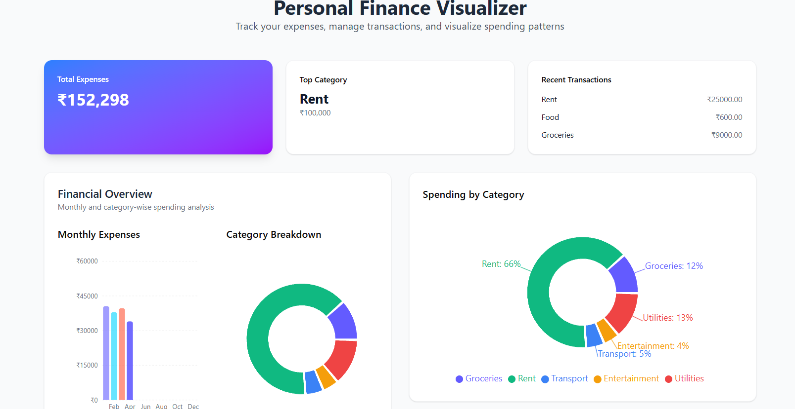
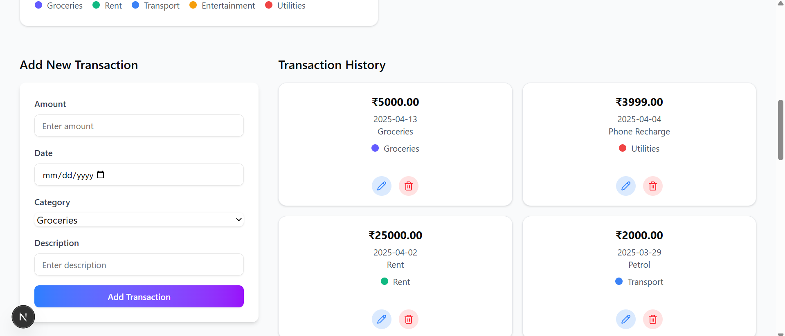

# Personal Finance Visualizer
A responsive web app for tracking personal finances, built with Next.js, React, shadcn/ui, and Recharts.

## Features
Add, edit, and delete transactions (amount, date, description, category)

Predefined categories for transactions (Groceries, Rent, Transport, Entertainment, Utilities)

Responsive transaction list view with category color indicators

Monthly expenses bar chart (Jan–Dec), updated with every transaction

Category-wise pie chart for visualizing spending breakdown

Dashboard summary cards: total expenses, top category, most recent transactions

Basic form validation and error states

Clean, modern UI 

## Tech Stack
Next.js 15

React 19

shadcn/ui

Recharts

Tailwind CSS

(MongoDB integration planned for later stage)

## Getting Started
1. Clone the repo:

bash
```git clone https://github.com/yanshiii/personal-finance-visualizer.git```
```cd personal-finance-visualizer```

2. Install dependencies:
bash
```npm install```

3. Run the development server:
bash
```npm run dev```

4. Open http://localhost:3000 in your browser.

## Screenshots



## License
This project is licensed under the terms of the MIT license.

